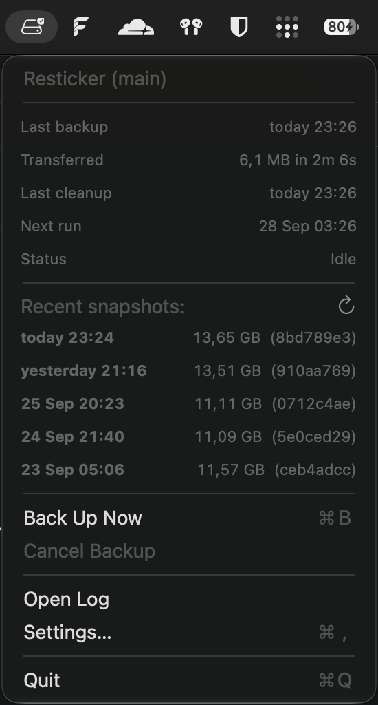
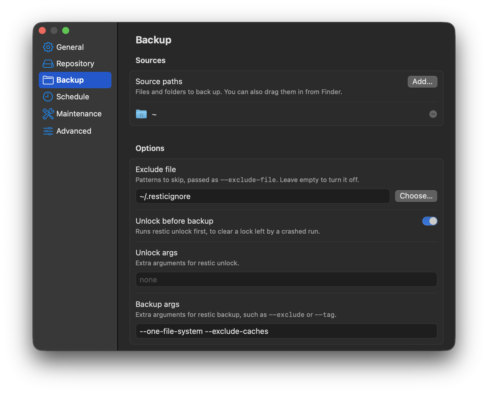

# Resticker

<p align="center">
  
</p>

*Chuck Norris does not use Resticker. His files are too afraid to get lost.* For
everyone else, Resticker is a macOS menu bar app that runs [restic](https://restic.net)
backups on a schedule. It backs up in the background, catches up after your Mac wakes
from sleep, and shows the last backup time, how much data moved, and your recent
snapshots right in the menu.

<p align="center">
  
  
</p>

## Why Resticker

- **Catch-up runs** — if your Mac was asleep through a scheduled backup, Resticker runs
  it once after waking, instead of replaying every slot it missed.
- **Menu bar status** — last backup time, data transferred, next scheduled run, and
  your recent snapshots, all visible without opening a terminal.
- **Scheduled maintenance** — `restic forget --prune` and `restic check` run
  automatically on their own interval after a successful backup, so retention and
  integrity checks don't need a separate cron job.
- **Automatic retries** — a failed backup retries a configurable number of times, with
  a delay between attempts, before falling back to the regular schedule.
- **Keychain-backed secrets** — your restic repository password and any cloud
  credentials are stored in the macOS keychain, not a config file.
- **Any restic backend** — local disks, SFTP, S3, or any other repository location
  restic supports, plus any extra restic arguments or environment variables your setup
  needs.
- **macOS notifications** — always on failure, optionally on success too.

### Why not just a cron job?

A cron entry misses runs while your Mac sleeps, gives no status without digging
through logs, and rarely gets a `forget`/`check` step added alongside it. Resticker
closes those three gaps; it doesn't replace restic.

## Getting Started

**Prerequisites:** macOS 14 or later, and restic itself:

```sh
brew install restic
```

### 1. Install via Homebrew

```sh
brew tap marcboeker/resticker https://github.com/marcboeker/resticker
brew install --cask resticker
open /Applications/Resticker.app
```

Prefer to download a release directly or build the app yourself instead? See
[docs/INSTALL.md](docs/INSTALL.md).

### 2. Configure

On first launch, Resticker has no repository, so it opens **Settings…** (⌘,) by
itself. On the **Repository** page, enter your repository location and password —
the password goes straight to the keychain. On the **Backup** page, add your source
paths. Everything else has a sensible default and is explained next to its own
setting in the window. Every change saves and applies right away, so there is
nothing to reload or restart.

You can reopen Settings any time from the menu bar icon. By default, Resticker
backs up every 4 hours and runs maintenance (forget + check) once a day.

## Behavior

A few things worth knowing before you rely on this:

- Resticker refuses to start a backup while the repository, a source path, or the
  repository password is missing. The menu bar icon shows "Not configured" with the
  specific reason, and Settings marks the affected page and row.
- Once configured, the first launch has no recorded backup, so one starts right away.
- If your Mac was asleep through a scheduled backup, it runs once after waking, not
  once for every slot it missed.
- `forget` (the retention/pruning step) is not scoped by host or tag, so it applies to
  every snapshot in the repository. Only point Resticker at a repository that holds
  backups from this Mac alone.
- **Cancel Backup** stops restic cleanly and does not leave a stale lock or count as a
  failed run.
- Adding a source path that needs extra access, such as Mail, Messages, or Photos,
  triggers the macOS privacy dialog right away. If you deny it, Settings shows a
  warning with a button to open **Privacy & Security → Full Disk Access**.

## Restoring your data

Resticker has no restore UI (yet). Restoring is a plain restic command against your
repository, see the [restic restore documentation](https://restic.readthedocs.io/en/stable/050_restore.html).

## License

MIT, see [LICENSE](LICENSE).
