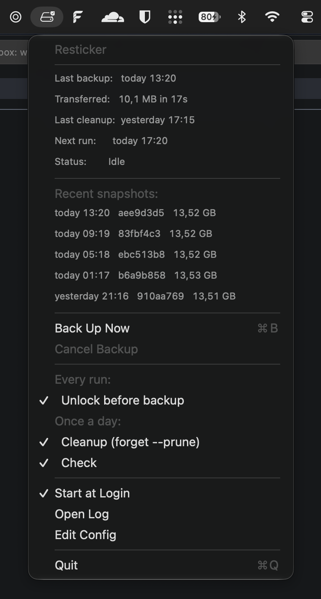

# Resticker

<p align="center">
  
</p>

Resticker is a macOS menu bar app that runs [restic](https://restic.net) backups on a
schedule. It backs up in the background, catches up after your Mac wakes from sleep,
and shows the last backup time, how much data moved, and your recent snapshots right
in the menu.



## Getting Started

**Prerequisites:** macOS 14 or later, and restic itself:

```sh
brew install restic
```

Get the app one of three ways:

### Option A: Install via Homebrew

```sh
brew tap marcboeker/resticker https://github.com/marcboeker/resticker
brew install --cask resticker
open /Applications/Resticker.app
```

### Option B: Download a release

Grab the latest `Resticker-macos-arm64.zip` from the
[Releases page](https://github.com/marcboeker/resticker/releases), unzip it, and move
`Resticker.app` to `~/Applications`. Then open it:

```sh
open ~/Applications/Resticker.app
```

The app is ad-hoc signed, so macOS Gatekeeper will refuse to open it with a normal
double-click the first time. Either right-click the app and choose **Open**, or clear
the quarantine flag yourself:

```sh
xattr -dr com.apple.quarantine ~/Applications/Resticker.app
```

### Option C: Build it yourself

Clone this repository, then build and install the app:

```sh
git clone https://github.com/marcboeker/resticker.git
cd resticker
make install
open ~/Applications/Resticker.app
```

`make install` builds the app and copies it to `~/Applications`.

By default, `make install` ad-hoc signs the app. An ad-hoc signature has no stable
identity, so it changes on every build. macOS ties keychain access to the exact
signature that created an item, so after each `make install` you'll be asked to
confirm access to your stored repository password again. See
[Sign the app locally](#sign-the-app-locally) below to avoid this.

### Sign the app locally

To keep a stable signature across rebuilds (and stop the repeated keychain prompt),
sign with your own identity instead of ad-hoc:

1. List the codesigning identities in your keychain:

   ```sh
   security find-identity -v -p codesigning
   ```

   If you don't have one, open **Keychain Access** and create a self-signed
   certificate (**Certificate Assistant → Create a Certificate…**, type
   **Code Signing**). An Apple Developer account also works, if you have one.

2. Copy `.env.example` to `.env` and set `CODESIGN_IDENTITY` to that identity's name:

   ```sh
   cp .env.example .env
   ```

   ```
   CODESIGN_IDENTITY=Apple Development: you@example.com (TEAMID)
   ```

   If multiple identities share the same name, use the SHA-1 hash shown by
   `security find-identity` instead, to pin the exact one.

3. Run `make install` as usual. The Makefile reads `.env` automatically, so the
   signature stays the same on every rebuild and macOS stops asking for your
   keychain password.

`.env` is gitignored, so your identity stays local. You can still override it for a
single build without touching `.env`: `make install CODESIGN_IDENTITY="..."`.

### Store your repository password

Either way, once the app is installed and running, click the menu bar icon and choose
**Set Repository Password…** to store your restic repository password in the keychain.
Resticker can't start a backup until this is set.

On first launch, Resticker creates `~/.config/resticker/config.json` with a commented
example, then starts a backup right away (see Behavior below). Edit the file, either
by hand or with **Edit Config** in the menu, to point `resticBinaryPath`,
`repository`, and `sourcePaths` at your own setup before or after that first run.
Changes are picked up automatically the moment you save.

Once that's set, click the menu bar icon and tick **Start at Login** so Resticker
keeps backing up after a restart.

## Configuration

Every setting, the retention policy, and any extra restic arguments live in
`~/.config/resticker/config.json`. See
[docs/CONFIGURATION.md](docs/CONFIGURATION.md) for the full list of keys.

## Behavior

A few things worth knowing before you rely on this:

- The first launch has no recorded backup, so one starts right away.
- If your Mac was asleep through a scheduled backup, it runs once after waking, not
  once for every slot it missed.
- `forget` (the retention/pruning step) is not scoped by host or tag, so it applies to
  every snapshot in the repository. Only point Resticker at a repository that holds
  backups from this Mac alone.
- **Cancel Backup** stops restic cleanly and does not leave a stale lock or count as a
  failed run.

## Other make targets

| Target | Action |
| --- | --- |
| `make build` / `make test` | Build or run the unit tests without installing. |
| `make run` | Install and launch in one step. |
| `make uninstall` | Removes the app. Leaves your config and keychain item in place. |
| `make clean` | Removes build output. |

See [Sign the app locally](#sign-the-app-locally) to set a stable `CODESIGN_IDENTITY`.
